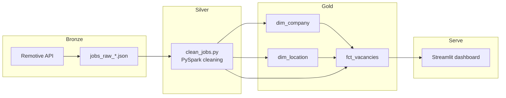

# Tech Job Market Pipeline (Azure & Databricks Ready)

[](https://www.python.org/)
[](https://spark.apache.org/)
[](https://delta.io/)
[](.github/workflows/ci.yml)
[](https://docs.pytest.org/)
[](https://streamlit.io/)
[](https://azure.microsoft.com/)

Deze pipeline haalt remote IT-vacatures op, schoont ze op en modelleert ze als een Delta Lake-sterschema. Lokaal landen de lagen onder `data/`. Met `STORAGE_TYPE=azure` schrijft dezelfde job naar Azure Data Lake Storage via `abfss://`, zodat de transformatie zonder codewijziging op Databricks kan draaien.

## Architectuur



| Laag | Wat er gebeurt | Opslag |
| --- | --- | --- |
| Bronze | Ruwe API-response, zonder transformatie | `data/raw/jobs_raw_<UTC>.json` |
| Silver | Relevante kolommen, HTML eruit, titel-filter, timestamps | `data/processed/delta/silver/jobs` |
| Gold | Sterschema met surrogaatsleutels | `data/processed/delta/gold/` |
| Serve | Totalen, categorieën, locaties en een zoekbare tabel. DuckDB leest Gold; zonder die bestanden schoont Python bronze JSON, de live API of `data/sample` op | `streamlit run src/dashboard/app.py` |

## Medallion-patroon

Elke laag heeft een vaste verantwoordelijkheid.

De bronze-laag bewaart de API-response zoals Remotive die stuurt. Daardoor blijft de bron herhaalbaar en kun je een schonere silver-logica later opnieuw afspelen zonder opnieuw te scrapen.

De silver-laag maakt de vacatures analyseerbaar. Het script houdt `id`, `title`, `company_name`, `category`, `publication_date`, `candidate_required_location`, `salary` en `description`. HTML-tags verdwijnen uit de beschrijving, de publicatiedatum wordt een timestamp, en alleen titels met `data`, `engineer`, `developer` of `python` blijven over. Bij een dubbele `id` wint de nieuwste publicatie.

De gold-laag is het sterschema voor rapportage. Feiten en dimensies worden als Delta-tabellen weggeschreven, zodat schema-evolutie en overwrites veilig zijn. `STORAGE_TYPE=local` gebruikt `data/processed/delta`. `STORAGE_TYPE=azure` gebruikt `abfss://<container>@<account>.dfs.core.windows.net/processed/delta`.

## Gegevensmodel

Het sterschema scheidt wie de vacature plaatst en waar de kandidaat moet zitten van de vacature zelf.

- `dim_company` bevat unieke bedrijfsnamen en een gegenereerde `company_id`.
- `dim_location` bevat de locatie-eis zoals die gepubliceerd is, inclusief een kommagescheiden regio, met een gegenereerde `location_id`.
- `fct_vacancies` bevat één rij per vacature: `vacancy_id`, beide foreign keys, publicatiedatum, titel, categorie, salaris en de opgeschoonde beschrijving.

Ontbrekend bedrijf of ontbrekende locatie wordt `Unknown` of `Unspecified`, zodat elke feitregel beide sleutels heeft. De surrogaatsleutels zijn `row_number`-waarden, gesorteerd op naam. Ze zijn stabiel voor dezelfde invoer en worden bij elke volledige refresh opnieuw opgebouwd. Een aparte brugtabel voor losse regio's is bewust nog niet toegevoegd: de grain van de locatie is de eis op de vacature, niet het individuele land.

## Projectstructuur

```text
src/extract/fetch_jobs.py       bronze-extractie
src/transform/clean_jobs.py     silver en gold
src/dashboard/app.py            Streamlit-dashboard, zonder PySpark
data/raw/                       bronze JSON
data/processed/delta/           Delta-tabellen
data/sample/jobs_sample.json    demo voor Streamlit Cloud
packages.txt                    apt-pakket voor Streamlit Cloud
runtime.txt                     Python 3.12 op Streamlit Cloud
tests/                          pytest
.github/workflows/ci.yml        CI op main en master
```

## Lokaal draaien

Python 3.12 en een JDK 17 of nieuwer zijn verplicht. PySpark gebruikt de JVM. Zet `JAVA_HOME`, of plaats een JDK onder `%LOCALAPPDATA%\jdks`; het transformatiescript zoekt daar als `JAVA_HOME` leeg is.

```powershell
python -m venv .venv
.venv\Scripts\Activate.ps1
pip install -r requirements.txt
copy .env.example .env
python -m src.extract.fetch_jobs
python -m src.transform.clean_jobs
streamlit run src/dashboard/app.py
```

`fetch_jobs.py` vraagt Remotive, Jobicy en Arbeitnow zonder API-sleutel. De standaardrun haalt de categorieën `dev`, `data`, `software-dev` en `backend` op, volgt de Arbeitnow-pagina's, en schrijft één samengevoegd bestand `data/raw/jobs_raw_<YYYYMMDD_HHMMSS>.json`. `--search Python` blijft een losse Remotive-zoekopdracht.

`clean_jobs.py` leest alle JSON-bestanden in `data/raw/` in één Spark-scan, verwijdert dubbele vacatures op id en op titel plus bedrijfsnaam, en overschrijft de Delta-tabellen. Aan het eind schrijft het `fct_vacancies` als één gecomprimeerd bestand naar `data/sample/gold_jobs_sample.parquet`. Voor Azure vul je in `.env` `STORAGE_TYPE=azure`, `AZURE_STORAGE_ACCOUNT` en `AZURE_STORAGE_CONTAINER`. `AZURE_STORAGE_ACCOUNT_KEY` zet shared-key auth; op Databricks kan een managed identity die sleutel vervangen.

Het dashboard heeft die JDK niet nodig en importeert geen modules uit `src`. Het leest de Gold Delta-tabellen met DuckDB. Ontbreken die, dan leest het `data/sample/gold_jobs_sample.parquet`.

## Streamlit Cloud

Zet het main file op `src/dashboard/app.py`. Python komt uit `runtime.txt` (3.12). Dependencies komen uit `requirements.txt`. `packages.txt` installeert `libgomp1`, de OpenMP-runtime waar DuckDB op Linux aan linkt. PySpark staat in `requirements.txt` voor de lokale transformatie en CI, maar `app.py` importeert het niet.

`data/raw` en `data/processed` gaan niet mee in git. `data/sample/gold_jobs_sample.parquet` wel. Op Cloud leest het dashboard dat Parquet-bestand, dezelfde 700+ vacatures uit de Gold-laag.

## Kwaliteitscontrole

```powershell
python -m pytest
```

De tests dekken de HTTP-extractie, de silver-opschoning, het sterschema en een Delta-roundtrip. GitHub Actions draait dezelfde suite op Ubuntu met Python 3.12 en OpenJDK 17, bij elke push en pull request naar `main` of `master`.

## Bronvermelding

Vacatures komen van de [Remotive Remote Jobs API](https://remotive.com/remote-jobs/api). Toon je ze ergens anders, link dan terug naar de Remotive-vacature en noem Remotive als bron.
